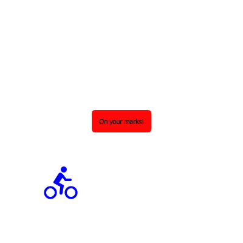
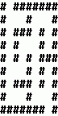

# qt5-qml-promises-demo
Qt5 QML application that demonstrates using Promises in QML application.

Sleep Demo
----------

Demonstrates how to use sleep() to add a delay in your Promise chain.

```qml
QMLPromises {
    id: sleepDemo
    function runAsync() {
        asyncToGenerator( function* () {
            _console.log('One');
            yield sleep(1000);
            _console.log('Two');
            yield sleep(1000);
            _console.log('Three');
        } )();
    }
}
```

Pi Demo
-------

Demonstrates how to use pass() to allow an application catch up on UI/UX events.

```qml
QMLPromises {
    id: piCalculator
    property double pi: 4.0
    function runAsync() {
        asyncToGenerator( function* () {
            let ts = Date.now();
            pi = 4.0;
            for (let den = 3; ; ) {
                pi -= 4.0 / den;
                den += 2;
                pi += 4.0 / den;
                den += 2;
                if (Date.now() > ts + 200) {
                    yield pass();
                    ts = Date.now();
                }
            }
        } )();
    }
}
```

Bicycle Demo
------------

Animates a Bicycle SVG graphic using numberAnimation in a Promise chain.



```qml
QMLPromises {
    id: bicycleAnimation
    function runAsync() {
        asyncToGenerator( function* () {
            bicycle.x = 50;
            bicycle.y = 250;
            bicycle.rotation = 0;
            message.text = qsTr("On your marks!");
            message.color = "black";
            messageFrame.background.color = "red";
            yield numberAnimation( { target: messageFrame, property: "opacity", from: 1.0, to: 0.0, duration: 1000 } );
            message.text = qsTr("Get set!");
            message.color = "black";
            messageFrame.background.color = "yellow";
            yield numberAnimation( { target: messageFrame, property: "opacity", from: 1.0, to: 0.0, duration: 1000 } );
            message.text = qsTr("Go!");
            message.color = "white";
            messageFrame.background.color = "green";
            yield numberAnimation( { target: messageFrame, property: "opacity", from: 1.0, to: 0.0, duration: 1000 } );
            yield numberAnimation( { target: bicycle, property: "x", from: 50, to: 250, duration: 1000 } );
            yield numberAnimation( { target: bicycle, property: "rotation", from: 0, to: -90, duration: 1000 } );
            yield numberAnimation( { target: bicycle, property: "y", from: 250, to: 50, duration: 1000 } );
            yield numberAnimation( { target: bicycle, property: "rotation", from: -90, to: -180, duration: 1000 } );
            yield numberAnimation( { target: bicycle, property: "x", from: 250, to: 50, duration: 1000 } );
            yield numberAnimation( { target: bicycle, property: "rotation", from: 180, to: 90, duration: 1000 } );
            yield numberAnimation( { target: bicycle, property: "y", from: 50, to: 250, duration: 1000 } );
            yield numberAnimation( { target: bicycle, property: "rotation", from: 90, to: 0, duration: 1000 } );
        } )();
    }
}
```

ArcGIS Search Demo
------------------

Demonstrates how to iterate through results of a REST API.

```qml
QMLPromises {
    id: search
    function runAsync() {
        asyncToGenerator( function * () {
            let portal = "https://www.arcgis.com";
            let start = 1;
            while (start >= 1) {
                let search = yield fetch( {
                    "method": "POST",
                    "url": `${portalUrl}/sharing/rest/search`,
                    "body": {
                        "q": "type:web map",
                        "start": start,
                        "num": 100,
                        "f": "pjson"
                    },
                    "headers": {
                        "Content-type": "application/x-www-form-urlencoded"
                    }
                } );
                console.log("start:", start, "results: ", search.response.results.length, "nextStart: ", search.response.nextStart, "total: ", search.response.total);
                if (search.response.nextStart === -1) { break; }
                start = search.response.nextStart;
            }
        } )();
    }
}
```

Maze Demo
---------

Demonstrates how to solve problems with Promise recursion.



```qml
QMLPromises {
    id: mazeDemo
    property var solve: (() => {
        var _ref = _asyncToGenerator(function* (x, y) {
            // Make the move (if it's wrong, we will backtrack later).
            set(x, y, someDude);
            yield sleep(100);
            // Try to find the next move.
            if (x === endingPoint[0] && y === endingPoint[1]) return true;
            if (get(x - 1, y) === free && (yield solve(x - 1, y))) return true;
            if (get(x + 1, y) === free && (yield solve(x + 1, y))) return true;
            if (get(x, y - 1) === free && (yield solve(x, y - 1))) return true;
            if (get(x, y + 1) === free && (yield solve(x, y + 1))) return true;
            // No next move was found, so we backtrack.
            set(x, y, free);
            yield sleep(100);
            return false;
        });
        return function solve(_x, _y) {
            return _ref.apply(this, arguments);
        };
    })();

    function runAsync() {
        asyncToGenerator( function* () {
            message.text = qsTr("Solving");
            if (yield solve(startingPoint[0], startingPoint[1])) {
                message.text = qsTr("Solved!");
            } else {
                message.text = qsTr("Cannot solve. :-(");
            }
        } )();
    }
}
```

This application uses the following Qt5 QML submodule libraries:
 - https://github.com/stephenquan/qt5-qml-promises
 - https://github.com/stephenquan/qt5-qml-sortlistmodel

To clone this repo, use:

    git clone https://github.com/stephenquan/qt5-qml-promise-demo.git
    git submodule update
